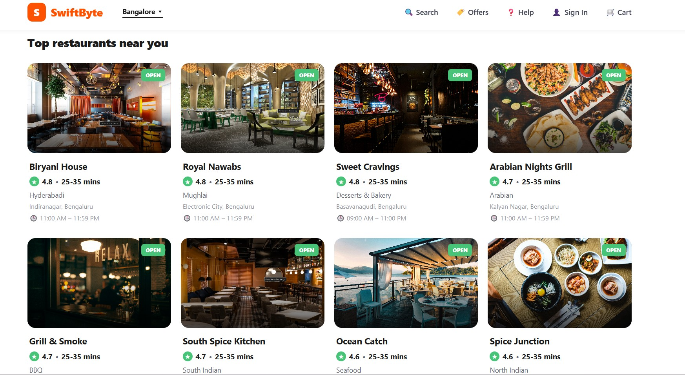
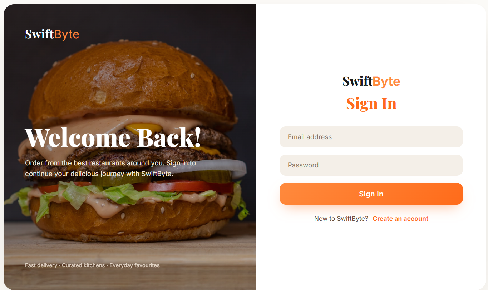
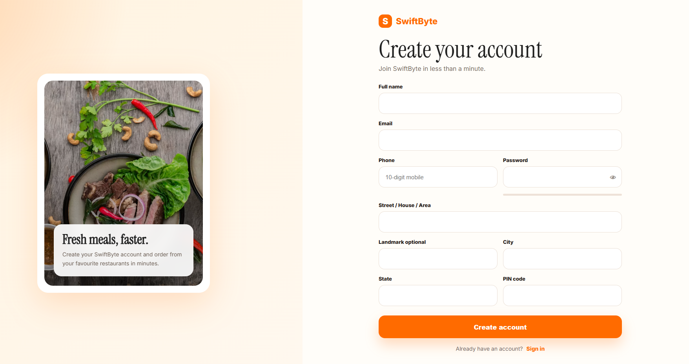
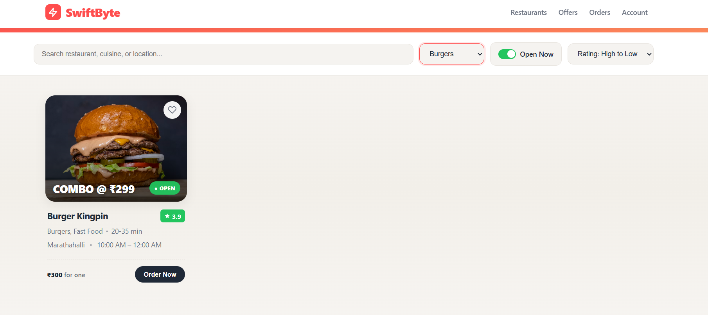
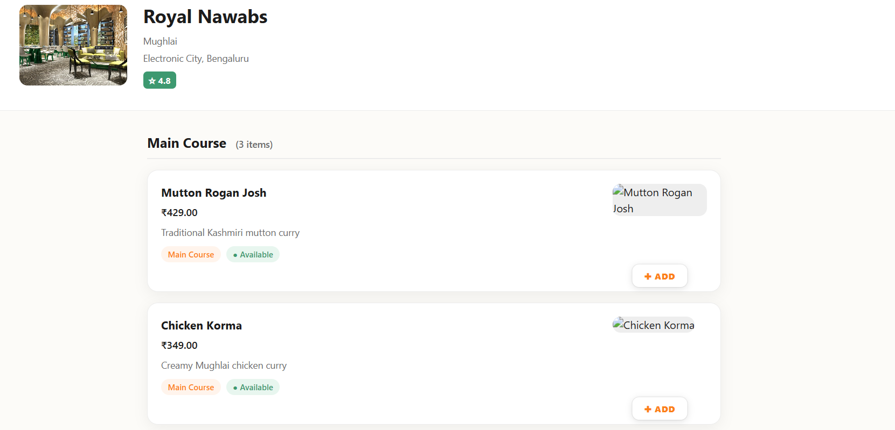
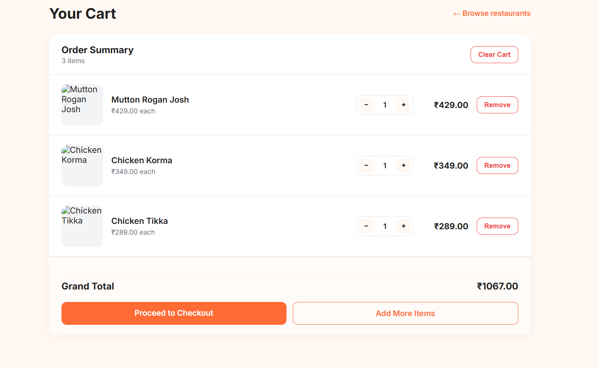
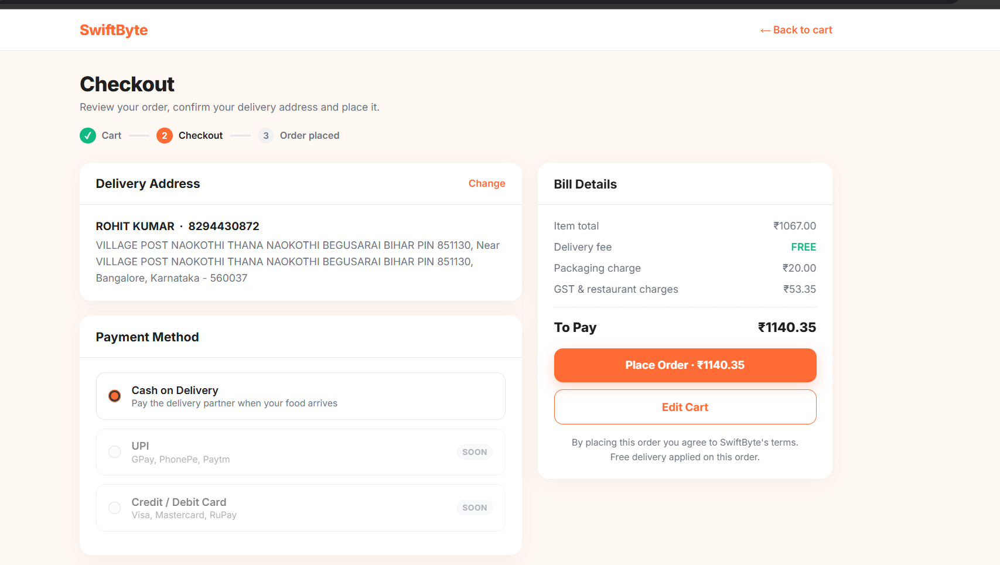
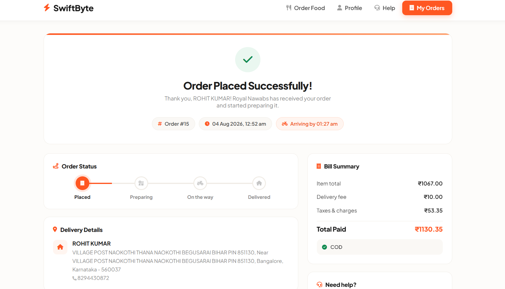
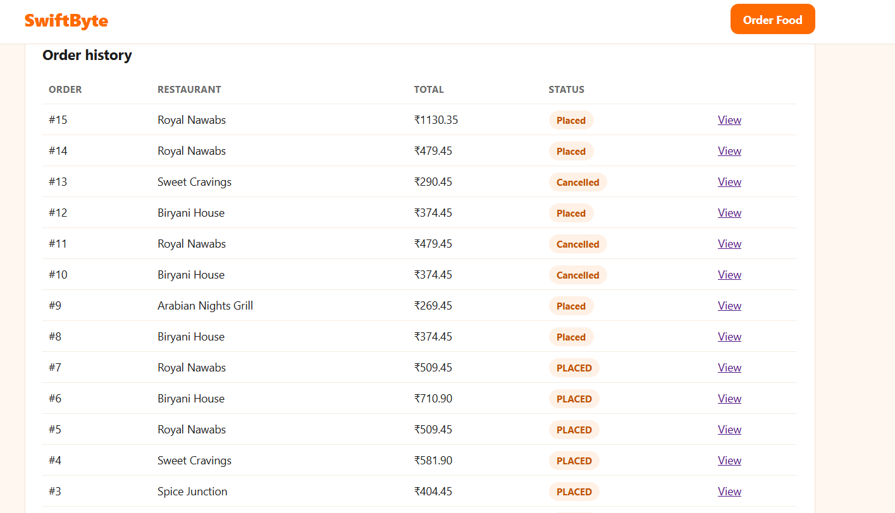

# 🍔 SwiftByte

> **SwiftByte — Engineered for hunger. Built for scale.**

SwiftByte is a full-stack food delivery web application built using **Java, JSP, Jakarta Servlets, JDBC, MySQL, HTML5, CSS3, and JavaScript**.

It provides an end-to-end food ordering workflow where users can register and authenticate, discover restaurants, explore menus, manage a persistent cart, and place orders through a responsive web interface.

Rather than functioning as a collection of independent CRUD screens, SwiftByte focuses on **layered architecture, relational data integrity, secure data handling, persistent state management, and separation of concerns**.

---

## 🛠️ Tech Stack

### Frontend

- HTML5
- CSS3
- JavaScript
- JSP

### Backend

- Java
- Jakarta Servlets
- JDBC

### Database

- MySQL

### Server

- Apache Tomcat 10.1

### Build & Dependency Management

- Maven

### Version Control

- Git
- GitHub

---

# ✨ Key Features

## 🔐 Secure Authentication & User Management

- User registration and login system
- SHA-256 password hashing for credential storage
- Session-based authentication and user session management
- Server-side input validation
- Protected access to authenticated user functionality

## 🍽️ Dynamic Restaurant Discovery

- Browse restaurants dynamically fetched from the MySQL database
- View detailed restaurant information and availability
- Explore restaurant-specific menus with pricing and item details
- Database-driven restaurant and menu management

## 🛒 Cart & Checkout Management

- Add food items to the shopping cart
- Update item quantities dynamically
- Remove individual items or clear the entire cart
- Automatic calculation of item totals and cart value
- Restaurant-aware cart handling to maintain order consistency
- Persistent cart data managed through the database

## 📦 Order Management

- Convert cart items into customer orders
- Store order and order-item information in the database
- Maintain relationships between users, restaurants, menu items, and orders
- Track order information through a structured database model

## 🏗️ Layered Backend Architecture

- DAO (Data Access Object) pattern for separation of database logic
- Model classes for structured application data
- Servlet-based request processing and business flow
- JDBC-based persistence layer
- Reusable database connection management
- Clear separation between presentation, application, and data-access layers

## 🗄️ Relational Database Design

- MySQL-based persistent data storage
- Structured relationships between users, restaurants, menus, carts, and orders
- Primary and foreign-key constraints for maintaining data integrity
- Normalized relational data model
- Parameterized SQL operations using `PreparedStatement`

## ⚡ Performance & Reliability

- Maven-based dependency and build management
- DAO-based database operations
- Centralized database connectivity
- Server-side error handling and validation
- Relational constraints for maintaining data integrity

## 🎨 Modern & Responsive UI

- Responsive interface designed for desktop and mobile devices
- Modern food-delivery-inspired user interface
- HTML5, CSS3, and JavaScript-based frontend
- Dynamic JSP pages populated with backend data
- Clean navigation between restaurants, menus, cart, and orders

---

# 🏗️ Application Architecture

SwiftByte follows an **MVC-inspired layered architecture** designed to separate presentation, request processing, application models, and persistence responsibilities.

```text
┌──────────────────────────────┐
│       Client / Browser       │
│    HTML • CSS • JavaScript   │
└──────────────┬───────────────┘
               │
               ▼
┌──────────────────────────────┐
│          JSP Views           │
│      Presentation Layer      │
└──────────────┬───────────────┘
               │
               ▼
┌──────────────────────────────┐
│      Jakarta Servlets        │
│       Controller Layer       │
└──────────────┬───────────────┘
               │
               ▼
┌──────────────────────────────┐
│        Java Models           │
│          Model Layer         │
└──────────────┬───────────────┘
               │
               ▼
┌──────────────────────────────┐
│          DAO Layer           │
│   Interfaces + Impl Classes  │
└──────────────┬───────────────┘
               │
               ▼
┌──────────────────────────────┐
│        JDBC / MySQL          │
│       Persistence Layer      │
└──────────────────────────────┘
```

This structure prevents presentation logic, request-handling logic, and database operations from becoming tightly coupled.

---

# 🧩 Design Patterns Applied

## MVC (Model-View-Controller)

The application follows an MVC-inspired separation between:

- **Model** — Java model/JavaBean classes representing application entities
- **View** — JSP pages responsible for presenting dynamic application data
- **Controller** — Jakarta Servlets responsible for handling HTTP requests and controlling application flow

This separation makes the application easier to understand, maintain, and extend.

---

## DAO (Data Access Object)

Database operations are abstracted behind dedicated DAO interfaces and their implementations.

Examples include:

- `RestaurantDAO`
- `UserDAO`
- `CartDAO`
- `OrderDAO`

This keeps SQL and persistence logic separate from Servlet/controller code.

Instead of writing database queries directly inside Servlets, database operations are delegated to the DAO layer.

---

## Interface + Implementation Pattern

DAO contracts are separated from their concrete implementations.

```text
RestaurantDAO
      │
      └── RestaurantDAOImpl

UserDAO
      │
      └── UserDAOImpl

CartDAO
      │
      └── CartDAOImpl

OrderDAO
      │
      └── OrderDAOImpl
```

This structure reduces coupling between application components and makes persistence code easier to maintain or replace.

---

# 🗄️ Database Architecture

SwiftByte uses a **relational MySQL database** designed to maintain relationships between users, restaurants, menus, carts, and orders.

The database schema is normalized to reduce unnecessary data duplication and maintain relational integrity.

## Core Tables

| Table | Purpose |
|---|---|
| `users` | Stores customer accounts and hashed credentials |
| `restaurants` | Stores restaurant profiles, operational information, and location |
| `menu_items` | Stores restaurant-specific menu items and pricing |
| `cart` | Stores persistent customer cart information |
| `cart_items` | Stores individual items associated with a cart |
| `orders` | Stores order-level information |
| `order_items` | Stores individual items belonging to an order |

## Entity Relationships

```text
User
 │
 ├──────────────► Cart
 │                  │
 │                  └──────────► Cart Items
 │                                  │
 │                                  ▼
 │                              Menu Items
 │                                  │
 │                                  ▼
 │                              Restaurant
 │
 └──────────────► Orders
                    │
                    └──────────► Order Items
                                    │
                                    ▼
                                Menu Items
```

Primary and foreign-key constraints are used to preserve relationships between application entities.

Parameterized database operations use JDBC `PreparedStatement`, reducing the risk of SQL injection.

---

# 🔒 Security & Validation

SwiftByte implements security and validation controls across multiple layers of the application.

## 🔑 Password Protection

- Passwords are transformed using SHA-256 hashing before database storage
- Plain-text passwords are not stored directly in the database
- Migration to adaptive password-hashing algorithms such as **BCrypt** or **Argon2** is planned as a future security improvement


---

## 🛡️ SQL Injection Mitigation

Database operations use JDBC `PreparedStatement` instead of directly constructing SQL queries from user input.

```java
PreparedStatement
```

Parameterized queries help prevent user-controlled input from being interpreted as executable SQL.

---

## ✅ Input Validation

Validation is performed at two levels:

### Client-Side Validation

JavaScript validation provides immediate feedback to users and improves the overall user experience.

### Server-Side Validation

Java and Servlet-based validation verifies incoming data before application and database operations are performed.

Server-side validation remains authoritative because client-side validation can be bypassed.

---

## 👤 Session Management

- Authentication state is maintained using `HttpSession`
- Authenticated user information is associated with the server-side session
- Protected functionality verifies authentication before allowing access

---

## 🔄 Password Recovery

- Password-reset requests generate dedicated reset tokens
- Reset tokens have limited validity
- Tokens become invalid after successful password recovery

---

## 🧹 XSS Mitigation

User-controlled output is escaped before being rendered into JSP pages to reduce the risk of Cross-Site Scripting (XSS).

---

# 🔄 End-to-End Application Workflow

SwiftByte connects individual application components into a complete food-ordering workflow.

```text
User Registration / Login
           │
           ▼
   Restaurant Discovery
           │
           ▼
      Menu Exploration
           │
           ▼
      Add Items to Cart
           │
           ▼
 Persistent Cart Management
           │
           ▼
       Place Order
           │
           ▼
     Order Creation
           │
           ▼
  Persistent Order Data
```

This interconnected workflow differentiates SwiftByte from applications where create, read, update, and delete operations exist only as isolated screens.

---
# 📁 Project Structure

```text
SwiftByte/
│
├── src/
│   └── main/
│       │
│       ├── java/
│       │   └── com/swiftbyte/
│       │       ├── model/
│       │       ├── dao/
│       │       ├── dao/impl/
│       │       ├── web/
│       │       └── util/
│       │
│       └── webapp/
│           ├── css/
│           ├── js/
│           ├── images/
│           ├── WEB-INF/
│           └── *.jsp
│
├── screenshots/
├── pom.xml
├── .gitignore
└── README.md
```


# 📸 Screenshots

Application screenshots demonstrate the complete user workflow.

## 🏠 Home Page



## 🔐 Login & Registration





## 🍽️ Restaurant Discovery



## 📋 Restaurant Menu



## 🛒 Shopping Cart


## 🛒 Checkout



## 📦 Order



## 📦 Order history



---

# 🚀 Getting Started

## Prerequisites

Make sure the following tools are installed:

- Java JDK
- Apache Tomcat
- MySQL Server
- Maven
- Git

---

## 1. Clone the Repository

```bash
git clone <https://github.com/Rohitnkt/SwiftByte>
cd SwiftByte
```

---

## 2. Configure the Database

1. Start MySQL Server.
2. Create the SwiftByte database.
3. Import the project's SQL schema.
4. Configure the application's database connection.
5. Make sure database credentials and other secrets are not committed to the public repository.

---

## 3. Build the Project

```bash
mvn clean package
```

---

## 4. Deploy

Deploy the generated WAR file to Apache Tomcat.

Start Tomcat and open the application in your browser.

---

# 🗺️ Future Improvements

- Replace SHA-256 password storage with BCrypt or Argon2
- Introduce database connection pooling
- Add online payment integration
- Add real-time order tracking
- Add restaurant-owner functionality
- Develop an administrative dashboard
- Add advanced restaurant and menu search
- Introduce automated unit and integration testing
- Add REST APIs for future frontend/mobile clients
- Containerize the application using Docker

---

# 👨‍💻 Author

**Rohit Kumar**

Information Science & Engineering

---

# ⭐ Project Philosophy

SwiftByte was developed to apply Java full-stack development concepts to a complete real-world workflow while maintaining clear boundaries between the presentation, controller, model, and persistence layers.

The goal is not simply to demonstrate CRUD operations, but to demonstrate how multiple application components can work together through a structured architecture and relational data model.

> ### 🍔 SwiftByte — Engineered for hunger. Built for scale.